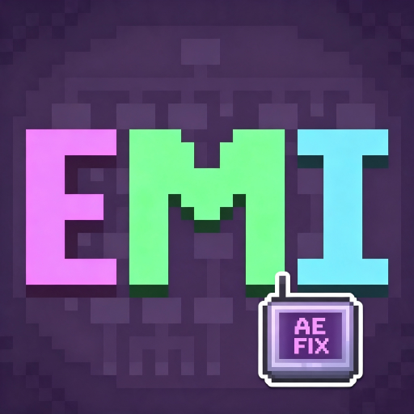

<div align="center">



# EMI AE2 Shift-Click Craft

[English](README_EN.md) | 中文

</div>

---

在 AE2 终端旁边用 EMI 时，Shift+点击配方是填不进合成格的——得先点开配方详情，再点加号。这个模组把那一步去掉。

## 为什么本来不行

EMI 的 Shift+点击传的是 `CRAFTABLE`，而 AE2 的终端（合成终端、无线合成终端、样板编码终端）只对加号按钮的 `FILL_BUTTON` 跑自己的传输逻辑；`CRAFTABLE` 会退回到默认逻辑，要求材料全在背包里，材料放在 ME 网络里就直接判定合不了。

## 装了就有的效果

在任意 AE2 系终端里 Shift+点击 EMI 配方：

- 材料在 ME 网络里 → 填进合成格 / 编码成样板
- 材料不全 → 和点加号一样提示缺什么，按住 Ctrl 可以自动提交缺的材料

没有配置，也没有界面。纯客户端，服务端不用装。

## 能用的终端

- AE2 合成终端
- AE2 无线合成终端
- AE2 样板编码终端
- 其他继承 AE2 `AbstractRecipeHandler` 的第三方终端，自动生效

## 原理

一个 Mixin：在 `canCraft` 里把 `CRAFTABLE` 当成 `FILL_BUTTON`。`craft()` 本身不看类型，所以 `canCraft` 一过，后面跑的就是 AE2 原本那套填充分发逻辑，没有重写任何传输代码。

## 版本与分支

一个仓库，分支区分游戏版本，每个分支都是独立工程：

| 分支 | 游戏版本 | 加载器 |
|---|---|---|
| [`1.21.1`](../../tree/1.21.1) | 1.21.1 | NeoForge 21.1.x |
| [`1.20.1`](../../tree/1.20.1) | 1.20.1 | Forge 47.x |
| `26.1.2` | 26.1.2 | NeoForge（暂缺，原因见下） |

26.1.2 暂时做不了：AE2 的 26.1 线把 EMI 集成整个去掉了。26.1.12-beta 的 jar 里 `appeng/integration/modules/` 只剩 curios、igtooltip、itemlists、jade、wthit，JEI 和 EMI 都没有，仓库源码里也搜不到 `EmiCraftContext`。本模组要补的 `AbstractRecipeHandler` 在那里根本不存在。等 AE2 把 EMI 支持加回来再说。

## 依赖

- Minecraft 1.21.1、NeoForge 21.1.x
- AE2 19.2.x、EMI 1.1.18+

1.20.1 分支需要 AE2 **15.4.10 或更新**——EMI 原生支持是那一版才加进 AE2 的，更早的版本里没有被本模组打补丁的那段逻辑。

## 构建

把 EMI 的 jar 放进 `libs/`（下载地址写在 `libs/README.md` 里），然后：

```bash
./gradlew build
# 产物在 build/libs/
```

AE2 从 Maven Central 拉，不用手动放。EMI 只能用本地 jar：它发布在 Emi 自己的 maven（TerraformersMC 只是转发到 `repo.sleeping.town`），国内经常连不上，Central 上也没有。

改依赖版本：EMI 换 `libs/` 里的 jar，AE2 改 `gradle.properties` 的 `ae2_version`，NeoForge 改 `neo_version`。

## License

[MIT](LICENSE)
